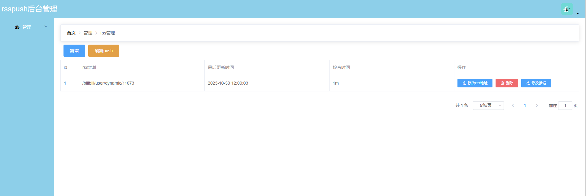
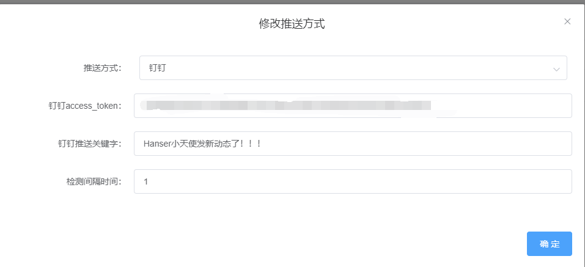

<h1 align="center">rsspush</h1>

这是一个检测bilibiliup主动态，自动推送到微信测试号的py脚本

前端项目：[rsspush-web](https://github.com/buyfakett/rsspush-web)

## 前置：

需要有docker环境，可以查看[我的初始化脚本](https://gitee.com/buyfakett/centos7_initialization/blob/master/initialization.sh)
中的install_docker方法来安装

## 安装：

```shell
# setp1：下载配置
mkdir -r rsspush/config && cd rsspush
# 下载docker-compose.yml（可以修改数据库账号密码）
wget https://raw.githubusercontent.com/buyfakett/rsspush/main/docker-compose.yml
# 下载配置文件
wget https://raw.githubusercontent.com/buyfakett/rsspush/main/config/config.yaml.bak -O config/config.yaml

# setp2：修改配置（详见下面）
vim config/config.yaml

# setp3：运行后端
docker-compose up -d

# setp4：运行前端（下载前端代码到nginx配置中）
地址：https://github.com/buyfakett/rsspush-web/tree/dist
```

### 配置文件示例

```yaml
# 数据库
ENGINE: django.db.backends.postgresql
DB_NAME: rsspush
DB_USER: rsspush
DB_PASSWORD: rsspush
DB_HOST: 0.0.0.0
DB_PORT: 5432
# token秘钥
token_private_key: j8mR75f473yNJz5yJg2GvmXKcXk3bx
# rsshub部署的地址
rss_hub_service: http://0.0.0.0:1200
```

### nginx配置示例

```nginx
server{
  listen 80;
  listen 443 ssl http2;
  server_name xxx;
  ssl_certificate /data/ssl/xxx.cer;
  ssl_certificate_key /data/ssl/xxx.key;
  ssl_session_timeout 5m;
  ssl_protocols TLSv1 TLSv1.1 TLSv1.2;
  ssl_ciphers ECDHE-RSA-AES128-GCM-SHA256:HIGH:!aNULL:!MD5:!RC4:!DHE;

  if ($server_port !~ 443){
        rewrite ^(/.*)$ https://$host$1 permanent;
    }

location /api {
      proxy_pass   http://127.0.0.1:8003/;
      rewrite ^/(.*)$ /$1 break;
      proxy_headers_hash_max_size 512;
      proxy_headers_hash_bucket_size 128;
      proxy_redirect off;
      proxy_set_header Host $host;
      proxy_set_header X-Forwarded-Proto $scheme;
      proxy_set_header X-Real-IP $remote_addr;
      proxy_set_header X-Forwarded-For $proxy_add_x_forwarded_for;
      proxy_set_header Upgrade-Insecure-Requests 1;
      proxy_set_header X-Forwarded-Proto https;
    }
location / {
        index index.html;
        root /data/web/rsspush/;
		try_files $uri $uri/ /index.html;
    }
}
```

### 项目截图





## 支持

1. 【Star】他，让他看到你是爱他的；

2. 【Watching】他，时刻感知他的动态；

3. 【Fork】他，为他增加新功能，修Bug，让他更加卡哇伊；

4. 【Issue】他，告诉他有哪些小脾气，他会改的，手动小绵羊；

5. 【打赏】他，为他买jk；

## 贡献指南

在develop分支上修改或者新开一个分支

## 其他

脚本不是很成熟，有bug请及时在github反馈哦~ 或者发作者邮箱：buyfakett@vip.qq.com

觉得作者写的不错的话可以支持一下作者，请作者喝一杯咖啡哦~

| 支付宝                              | 微信                            |
|----------------------------------|-------------------------------|
|  |  |